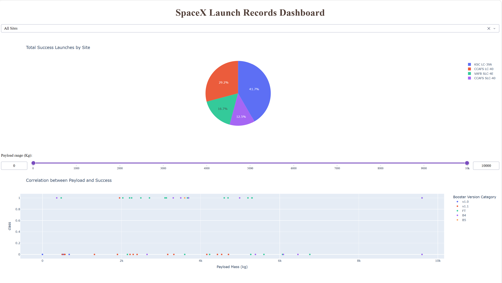
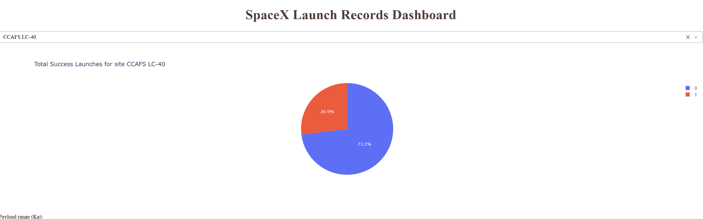
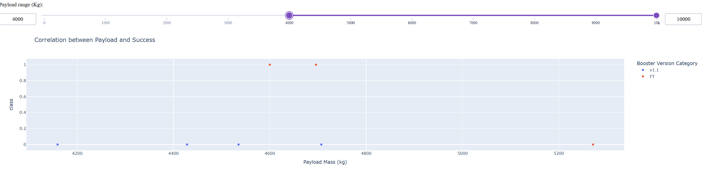

# SpaceX Falcon 9 First-Stage Landing Prediction

## Project Overview

This project investigates whether SpaceX Falcon 9 first-stage booster landings can be predicted using historical launch data and machine learning.

Completed as the capstone project for the IBM Data Science Professional Certificate, this project applies the data science workflow from data collection and exploratory analysis through interactive visualization and predictive modeling.

## Objectives

- Collect launch data using the SpaceX REST API and web scraping.
- Clean, transform, and prepare data for analysis.
- Explore launch trends and relationships using Python, SQL, and data visualization.
- Build an interactive dashboard to explore launch outcomes by launch site and payload mass.
- Train and evaluate machine learning classification models to predict first-stage landing success.

## Project Workflow

### 1. Data Collection
Collected SpaceX launch data through the REST API and extracted additional information through web scraping.

### 2. Data Wrangling
Cleaned and prepared datasets for exploratory analysis and predictive modeling.

### 3. Exploratory Data Analysis (EDA)
Used Python visualizations and SQL queries to investigate launch outcomes, payloads, and launch-site patterns.

### 4. Interactive Dashboard
Developed a Plotly Dash application with interactive filters and visualizations to explore launch outcomes by launch site and payload mass.
### Dashboard Overview



### Launch-Site Analysis



### Payload-Range Analysis



### 5. Predictive Analysis
Trained and evaluated four classification algorithms:

- Logistic Regression
- Support Vector Machine (SVM)
- Decision Tree
- K-Nearest Neighbors (KNN)

All four models achieved **83.33% accuracy on the held-out test set**. The Decision Tree achieved the highest cross-validation score among the models in this experiment.

## Explore the Notebooks

Follow the project workflow through the notebooks below:

1. [SpaceX Data Collection Using the API](notebooks/jupyter-labs-spacex-data-collection-api.ipynb)
2. [SpaceX Data Collection Using Web Scraping](notebooks/jupyter-labs-webscraping.ipynb)
3. [Data Wrangling](notebooks/labs-jupyter-spacex-Data%20wrangling.ipynb)
4. [Exploratory Data Analysis](notebooks/edadataviz.ipynb)
5. [Exploratory Data Analysis with SQL](notebooks/jupyter-labs-eda-sql-coursera_sqllite.ipynb)
6. [Launch-Site Location Analysis](notebooks/lab_jupyter_launch_site_location.ipynb)
7. [Machine Learning Prediction](notebooks/SpaceX_Machine%20Learning%20Prediction_Part_5.ipynb)

## How to Run the Dashboard

The interactive dashboard allows users to explore SpaceX Falcon 9 launch outcomes by launch site and payload mass.

### Requirements

- Python 3
- pandas
- Plotly
- Dash

### Setup Instructions

1. Clone or download this repository.
2. Install the required Python libraries:

   ```bash
   python -m pip install pandas plotly dash
   ```

3. Make sure spacex_launch_dash.csv is available in the same directory as spacex-dash-app.py. The dataset is provided in the data/ folder.
4. Run the application:

   ```bash
   python spacex-dash-app.py
   ```

5. Open the local URL displayed in your terminal (typically `http://127.0.0.1:8050/`) in your browser.

Keep the terminal running while using the dashboard. Press `Ctrl+C` in the terminal to stop the application.

## Repository Structure

- `notebooks/` — Jupyter notebooks covering data collection, web scraping, data wrangling, SQL, exploratory analysis, launch-site mapping, and machine learning.
- `data/` — Datasets used for analysis and dashboard development.
- `screenshots/` — Screenshots and visual evidence of the project.
- `spacex-dash-app.py` — Python source code for the interactive dashboard.

## Tools and Technologies

Python · Pandas · NumPy · SQL · Scikit-learn · Plotly · Dash · Folium · Jupyter Notebook · REST APIs · Web Scraping

## Key Takeaway

This project demonstrates an end-to-end data science workflow, combining data collection, data preparation, exploratory analysis, interactive visualization, and machine learning model evaluation to investigate SpaceX Falcon 9 landing outcomes.

---

*Completed as part of the IBM Data Science Professional Certificate.*
